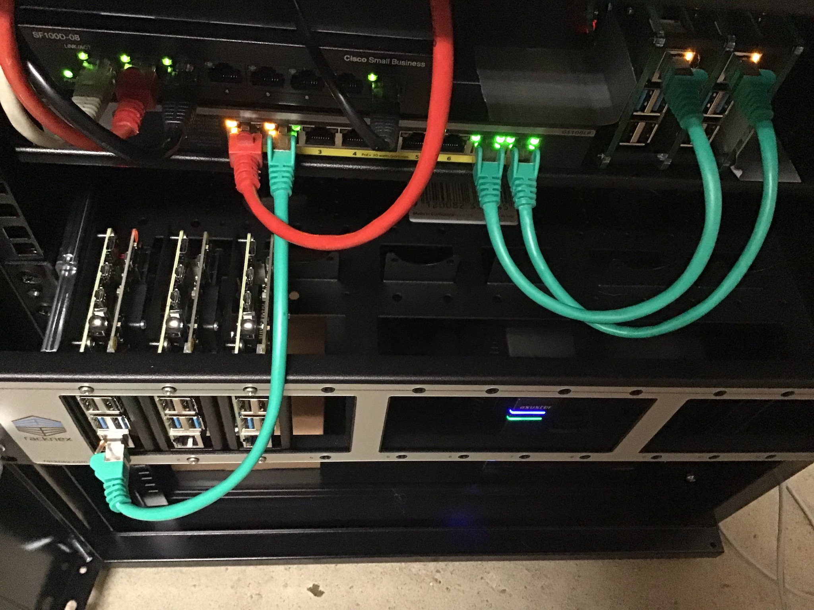

A raspberry pi cluster under construction</em>" class="border-0">

Wanna build an AI? Here is what you will have to do. 

* Automatically gather (lots of) data.
* Pre-process that data.
* [...]

### The age of pretrained models

Industrial research labs have been competing for several years, releasing so-called 'pretrained' models to the public. 

### 100% RPI-compatible

All our AI components are tested on single-board computers, to ensure they will work on low-level hardware. In practice, we test each component on Raspberry Pis, model 4, 8GB RAM. 

### 100% eco-friendly

We record the CO2 emissions of each AI component before releasing it, so that users are fully aware of their footprint. 
