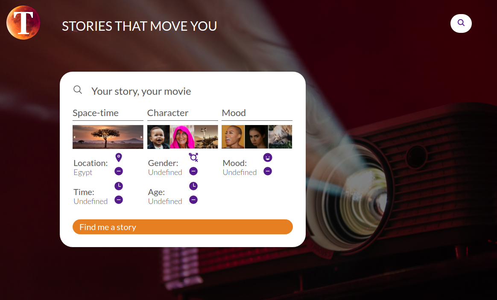

Toppix</em>" class="border-0">

*If you liked Star Wars, you will also like Star Trek.*

Wrong. 

We are by now used to those 'recommendations by similarity'. Recommendation engines rely on two mechanisms: a) user-based filtering; b) content-based filtering. [...]

### Intelligent recommendation

Toppix is 100% content-based. 

### Privacy-respecting

The dominant recommendation algorithm is based on the centralised collection on personal data: what consumers have bought, what they have liked on social media, what their friends have bought / liked, what 'similar' people are interested in.

### Recommendation engines - the market

The market for recommendation engines is predicted to grow to [$12.02 billion in 2025](https://www.industryarc.com/Research/Recommendation-Engine-Market-Research-500995). Recommendation is key to selling products to end consumers, whether offline (in you local bookshop) or online (on a large platform like Amazon). But is it good for SMEs and consumers in its current form? 

