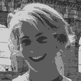
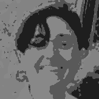

<table>
<tr>
<td width='50%'>
<b>  Nina Rismal (CEO)</b>

Nina is an economist and political philosopher interested in social change. She studied at SOAS, Oxford, and Cambridge, where she wrote her doctoral dissertation in defense of utopias. [...] 
</td>

<td width='50%'>
<b>  Aurelie Herbelot (CTO)</b> 

Aurelie has over 15 years' experience in academic research. Her specialisation is in building Natural Language Processing systems. She is the author of 40+ peer-reviewed publications. She holds a PhD in Computer Science from the University of Cambridge.
</td>
</tr>
</table>
